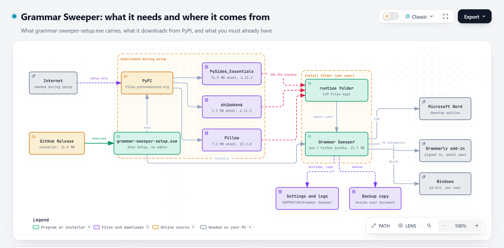

# Grammar Sweeper

Accepts Grammarly suggestions for a document, sweeping
the document page by page, so a document carrying thousands of suggestions for improvement does not
have to be clicked through one card at a time. Windows only.

## Disclaimer

**Read this before running it.**

- **This is unofficial and unaffiliated.** It is not made, endorsed, or
  supported by Grammarly. It automates Grammarly's user interface. Use it at your own risk, on your own account.
- **It applies suggestions without reading them.** Rewrite cards such as
  `Improve your text` restructure sentences. Accepting hundreds of them changes
  how a document argues, not only how it spells. Review the result.
- **There is no reliable undo except the backup.** Grammarly's edits are often
  not recorded by Word's Track Changes, so the revision count can stay at zero
  while the text changes. The tool writes a timestamped backup copy of the
  document before the first click. That copy is the only dependable way back.
  Do not run this on a document you have no other copy of.
- **No warranty.** See [LICENSE](LICENSE).

## Two ways to get it

| | Installer (`grammar-sweeper-setup.exe`) | Source code |
|---|---|---|
| For | Anyone who wants to sweep a document | Anyone who wants to read, run or change the code |
| You need | 64-bit Windows, desktop Word with Grammarly signed in, internet during setup | The same, plus Python 3.10 or later |
| Python | Not needed | Needed |
| How you start it | Start menu | `python -m sweeper` |
| Command line | Not offered | `python bulk_accept.py`, with the full option set |
| Where to look | This page, then the [user manual](MANUAL.md) | [Developer guide](docs/developer.md) |

**Most people want the installer.** The rest of this page is about it. Source users should go straight to the
[developer guide](docs/developer.md).

## Using the installer

`grammar-sweeper-setup.exe` is a **setup program**, not the tool itself. Running it installs Grammar Sweeper, and you then start
it from the Start menu.

**Dependency map.** What the installer carries, what setup downloads from PyPI, and what you must already have:

1. Download `grammar-sweeper-setup.exe` from the Releases page and run it. No administrator rights are needed.
2. Follow the wizard. During setup it downloads the Qt runtime that draws the window, and Pillow (see below).
3. Start **Grammar Sweeper** from the Start menu.
4. Open your document in Word, then open Grammarly's panel in Word so the suggestion list is visible. You open the panel;
   the program cannot do it for you.
5. In the Grammar Sweeper window, pick the document and a preset, then press Start. A small always-on-top box shows
   progress. Press Esc to stop.

Run it from a normal Windows session, never as administrator. Windows keeps an elevated process apart from a normal
Word, so an elevated Grammar Sweeper cannot reach your document.

The [user manual](MANUAL.md) covers the window, the summary at the end of a run, and troubleshooting.

### What you must already have

- 64-bit Windows.
- Desktop Microsoft Word, with Grammarly's add-in installed in Word and signed in.
- An internet connection while setup runs, and not afterwards.

You do not need Python, pip, a compiler, or Qt installed.

### What is inside, and what setup downloads

`grammar-sweeper-setup.exe` relies on Qt runtime and Pillow to be downloaded during setup
instead of being bundled.

| Part | Version | Where it comes from | Licence |
|---|---|---|---|
| Python runtime | 3.14.5 | Inside `grammar-sweeper-setup.exe` | PSF |
| pywin32 | 311 | Inside `grammar-sweeper-setup.exe` | PSF |
| uiautomation | 2.0.29 | Inside `grammar-sweeper-setup.exe` | Apache 2.0 |
| comtypes | 1.4.17 | Inside `grammar-sweeper-setup.exe` | MIT |
| PySide6_Essentials (Qt) | 6.11.2 | **Downloaded from PyPI during setup**, 76,913,043 bytes | LGPL-3.0-only OR GPL-2.0-only OR GPL-3.0-only |
| shiboken6 (Python to Qt bridge) | 6.11.2 | **Downloaded from PyPI during setup**, 1,226,578 bytes | LGPL-3.0-only OR GPL-2.0-only OR GPL-3.0-only |
| Pillow (draws the logo and texture) | 12.2.0 | **Downloaded from PyPI during setup**, 7,217,400 bytes | MIT-CMU |

The versions are those of the 0.3.0 build.

How setup handles the download:

- It fetches exactly three files from `files.pythonhosted.org` (PyPI, the Python package index) and contacts nothing else.
- Each file is checked against a SHA-256 hash that is pinned in the installer. A file that does not match is rejected
  and never unpacked.
- Of everything in those downloads, only the 149 files the program uses (41 for Qt, 108 for Pillow) are kept, in a `runtime` folder beside the program.
  The downloaded files are not modified and stay separate files, so they can be replaced.
- If a download fails, setup stops and installs nothing. After setup, the program needs no internet connection.
- Uninstalling removes the program and the `runtime` folder.
- `grammar-sweeper-setup.exe` is unsigned, so Windows SmartScreen may warn on first run. Choose More info, then Run anyway.

## What a run does

- Copies the document to `<name>.backup-<timestamp>.<ext>` beside the original.
- Switches Track Changes on (see the disclaimer: do not rely on it).
- Blocks system sleep and display-off for the life of the run, so a long run continues in the background. It does
  **not** block an idle screen lock, which breaks foreground automation just as sleep would.
- Sweeps the document page by page, accepting every suggestion card the panel offers, and repeats until two clean
  passes in a row, the preset's pass limit (`quick` 1, `standard` 4, `thorough` none), the 2 hour limit, or the
  repetition guard trips.
- Pauses if you switch to another app or document on purpose, and never clicks while the wrong document is in front.
  If a notification steals focus, it pulls Word back.
- Saves the document every 5 accepts and records running totals.
- Stops on its own after 5 running minutes without a real accept or a new page.

The full rules are in [docs/spec.md](docs/spec.md).

## Where the installed program keeps its files

| What | Where |
|---|---|
| Backup of your document | Beside the document |
| Settings | `%APPDATA%\Grammar Sweeper\settings.json` |
| Logs, reports, screenshots | `%APPDATA%\Grammar Sweeper\logs\` |
| The program and its runtime (Qt, Pillow) | The install folder, with Qt in its `runtime` subfolder |

Screenshots and reports can contain text from your document. The [user manual](MANUAL.md#where-files-go) has the full
list.

## Known limits

- Whether Track Changes captures Grammarly's edits varies by document and has not been established in general. Treat
  the backup as the only undo.
- Each accept writes to the live document while Grammarly is also editing it. The automated tests cover the engine
  rules and the screens, not the clicking; that has been exercised by hand against real documents only.
- The completion percentage is an estimate. The panel reports only the suggestions in the region on screen, so the
  count of what is left is a lower bound.
- Card wording is matched against what Grammarly's panel calls its buttons. A Grammarly redesign can break that. The
  [developer guide](docs/developer.md) explains the fallback and how to re-derive the names.
- Documents on SharePoint or OneDrive can be swept, but no backup copy can be made of them. Make your own copy first.
- Windows only.

## Documents

| Document | For |
|---|---|
| [MANUAL.md](MANUAL.md) | Using the installed window |
| [docs/developer.md](docs/developer.md) | Running from source, the command line and every option, how the panel works, how cards are found |
| [docs/spec.md](docs/spec.md) | Behaviour rules |
| [CONTRIBUTING.md](CONTRIBUTING.md) | Changing the code and building the installer |
| [SECURITY.md](SECURITY.md) | Reporting a security problem |

## Licence

MIT. See [LICENSE](LICENSE).
